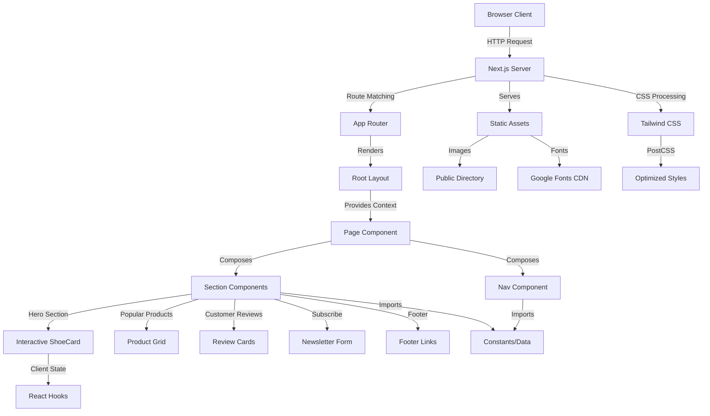
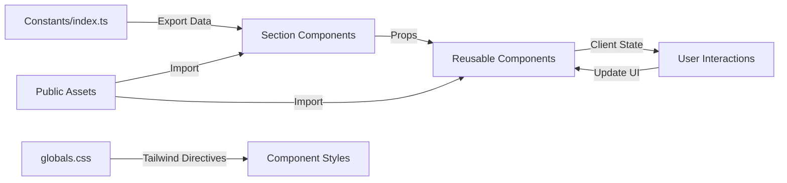

# Nike Landing Page - Next.js + Tailwind CSS Project

A modern, responsive Nike-themed e-commerce landing page built with Next.js 15, React 19, and Tailwind CSS 4. This project demonstrates best practices in modern web development, featuring a component-based architecture, optimized fonts, and a polished user interface.

## Overview

### Purpose

This project serves as a showcase for building production-ready marketing and e-commerce landing pages using the latest web technologies. It demonstrates the implementation of a multi-section landing page for a Nike-inspired shoe store, complete with product displays, customer reviews, newsletter subscription, and interactive components.

### Key Use Cases

- **Marketing Landing Pages**: Ideal template for product launches, seasonal campaigns, or brand showcases
- **E-commerce Storefronts**: Foundation for building online retail experiences with product catalogs
- **Portfolio Demonstrations**: Showcase for developers demonstrating modern React and Next.js skills
- **Learning Resource**: Educational project for understanding Next.js App Router, Tailwind CSS v4, and TypeScript integration

### Problem It Solves

- Provides a production-ready template for rapid development of marketing landing pages
- Demonstrates responsive design patterns that work across all device sizes
- Shows how to structure a scalable Next.js application with reusable components
- Implements modern web performance optimizations including font optimization and image handling

## Features

- **Modern Tech Stack**: Built with Next.js 15, React 19, TypeScript, and Tailwind CSS 4
- **Responsive Design**: Fully responsive layout that adapts seamlessly from mobile to desktop
- **Optimized Fonts**: Uses Google Fonts (Montserrat and Palanquin) with Next.js font optimization
- **Component-Based Architecture**: Modular, reusable components for maintainability and scalability
- **Interactive UI Elements**: Dynamic shoe showcase with image switching and hover effects
- **Multiple Landing Sections**:
  - Hero section with product showcase and statistics
  - Popular products grid with ratings
  - Quality showcase section
  - Services highlights (shipping, payment, support)
  - Special offers section
  - Customer reviews and testimonials
  - Newsletter subscription
  - Comprehensive footer with navigation
- **Custom Tailwind Configuration**: Extended theme with custom colors, utilities, and responsive breakpoints
- **Type-Safe Development**: Full TypeScript support for enhanced developer experience
- **Fast Development Server**: Turbopack-enabled dev server for instant feedback
- **ESLint Integration**: Code quality enforcement with Next.js recommended rules

## Architecture

### High-Level System Overview

This application follows the Next.js App Router architecture pattern, utilizing a server-side rendering (SSR) first approach with client-side interactivity where needed. The system is organized into a clear separation of concerns with layout, page, component, and constant layers.



### Low-Level Module Interactions

The application uses a hierarchical component structure with clear data flow:

**Data Flow Pattern:**


**Component Interaction Model:**

1. **Layout Layer** (`layout.tsx`):
   - Wraps entire application
   - Configures Google Fonts (Montserrat, Palanquin)
   - Provides metadata (title, description)
   - Applies global CSS variables

2. **Page Layer** (`page.tsx`):
   - Orchestrates all section components
   - Defines section order and spacing
   - Applies responsive padding utilities

3. **Section Layer** (`sections/`):
   - Self-contained feature sections (Hero, Products, Reviews, etc.)
   - Import and consume data from constants
   - Compose reusable components
   - Mix client and server components

4. **Component Layer** (`components/`):
   - Reusable UI elements (Button, Nav, ShoeCard)
   - Stateless when possible (Button, Nav)
   - Stateful when needed (ShoeCard with selection state)

5. **Data Layer** (`constants/index.ts`):
   - Centralized configuration and content
   - Product data, navigation links, services, reviews
   - Import public assets (images, icons)

**External Service Integration:**

- **Google Fonts**: Integrated via Next.js font optimization system
- **Static Assets**: Served directly from `/public` directory with Next.js optimized image loading
- **PostCSS/Tailwind**: Build-time CSS processing through PostCSS with Tailwind v4 plugin

**Design Patterns:**

- **Composition Pattern**: Sections compose smaller components
- **Props Drilling**: Data passed from constants through sections to components
- **Client-Side Interactivity**: Selective "use client" directives for interactive components (Hero shoe switching)
- **Static Generation**: Most content is statically generated at build time
- **CSS-in-JS via Tailwind**: Utility-first styling approach with custom theme extensions

## Folder Structure

```
first-tailwind-css-project/
├── public/                          # Static assets served directly
│   ├── icons/                       # SVG icons
│   │   ├── arrow-right.svg
│   │   ├── facebook.svg
│   │   ├── hamburger.svg
│   │   ├── instagram.svg
│   │   ├── shield-tick.svg
│   │   ├── star.svg
│   │   ├── support.svg
│   │   ├── truck-fast.svg
│   │   ├── twitter.svg
│   │   ├── copyright-sign.svg
│   │   ├── chevron-left.svg
│   │   ├── chevron-right.svg
│   │   └── index.ts               # Icon exports
│   ├── images/                      # Product and branding images
│   │   ├── big-shoe1.png           # Hero section shoe images
│   │   ├── big-shoe2.png
│   │   ├── big-shoe3.png
│   │   ├── shoe4.svg               # Product catalog images
│   │   ├── shoe5.svg
│   │   ├── shoe6.svg
│   │   ├── shoe7.svg
│   │   ├── shoe8.svg
│   │   ├── thumbnail-shoe1.svg     # Thumbnail images
│   │   ├── thumbnail-shoe2.svg
│   │   ├── thumbnail-shoe3.svg
│   │   ├── customer1.jpeg          # Customer testimonial photos
│   │   ├── customer2.svg
│   │   ├── header-logo.svg         # Branding assets
│   │   ├── footer-logo.svg
│   │   ├── offer.svg               # Marketing assets
│   │   ├── collection-background.svg
│   │   ├── thumbnail-background.svg
│   │   └── index.ts               # Image exports
│   ├── file.svg                    # Default Next.js assets
│   ├── globe.svg
│   ├── next.svg
│   ├── vercel.svg
│   ├── window.svg
│   └── favicon.ico
├── src/
│   └── app/                        # Next.js App Router directory
│       ├── components/             # Reusable UI components
│       │   ├── Nav.tsx            # Navigation header
│       │   ├── Button.tsx         # Reusable button component
│       │   └── ShoeCard.tsx       # Product thumbnail card
│       ├── constants/              # Static data and configuration
│       │   └── index.ts           # Navigation links, products, services, reviews
│       ├── sections/               # Page section components
│       │   ├── Hero.tsx           # Hero section with shoe showcase
│       │   ├── PopularProducts.tsx # Product grid section
│       │   ├── SuperQuality.tsx   # Quality showcase section
│       │   ├── Services.tsx       # Services highlight section
│       │   ├── SpecialOffer.tsx   # Special offers section
│       │   ├── CustomerReviews.tsx # Customer testimonials
│       │   ├── Subscribe.tsx      # Newsletter subscription
│       │   ├── Footer.tsx         # Footer with links and social
│       │   └── index.ts           # Section exports
│       ├── favicon.ico            # Browser tab icon
│       ├── globals.css            # Global styles and Tailwind config
│       ├── layout.tsx             # Root layout with fonts and metadata
│       └── page.tsx               # Home page composition
├── .gitignore                      # Git ignore rules
├── eslint.config.mjs              # ESLint configuration
├── next.config.ts                 # Next.js configuration
├── package.json                   # Dependencies and scripts
├── package-lock.json              # Locked dependency versions
├── postcss.config.mjs             # PostCSS configuration for Tailwind
├── tsconfig.json                  # TypeScript configuration
└── README.md                      # This file

Key Directories Explained:

- **public/**: Contains all static assets (images, icons, SVGs) that are served directly without processing
- **src/app/**: Next.js App Router application directory
  - **components/**: Reusable UI components used across multiple sections
  - **constants/**: Centralized data source for navigation, products, and content
  - **sections/**: Large page sections that compose the landing page
  - **globals.css**: Tailwind CSS imports, theme customization, and custom utilities
  - **layout.tsx**: Application shell with font configuration and metadata
  - **page.tsx**: Main homepage that orchestrates all sections
```

## Setup & Installation

### Prerequisites

Before you begin, ensure you have the following installed on your system:

| Requirement | Minimum Version | Recommended Version | Purpose |
|------------|-----------------|---------------------|---------|
| Node.js | 18.17.0+ | 20.x or 22.x | JavaScript runtime |
| npm | 9.x | 10.x | Package manager |
| Git | 2.x | Latest | Version control |

**Optional but Recommended:**
- **Code Editor**: VS Code with ESLint and Tailwind CSS IntelliSense extensions
- **Browser**: Modern browser (Chrome, Firefox, Safari, Edge) for testing

### Installation Steps

1. **Clone the repository**

```bash
git clone https://github.com/OluwaFavour/first-tailwind-css-project.git
cd first-tailwind-css-project
```

2. **Install dependencies**

```bash
npm install
```

This will install all required dependencies including:
- Next.js 15.1.7
- React 19.0.0
- Tailwind CSS 4.0.0
- TypeScript 5.x
- All development dependencies

3. **Verify installation**

```bash
# Check that all dependencies are installed
npm list --depth=0

# Run the linter to ensure code quality
npm run lint
```

4. **Start the development server**

```bash
npm run dev
```

The application will be available at [http://localhost:3000](http://localhost:3000)

### Alternative Package Managers

You can also use alternative package managers:

**Using Yarn:**
```bash
yarn install
yarn dev
```

**Using pnpm:**
```bash
pnpm install
pnpm dev
```

**Using Bun:**
```bash
bun install
bun dev
```

## Configuration

### Environment Variables

This project currently does not require environment variables for basic operation. However, if you plan to extend the project with external services, you can create a `.env.local` file in the root directory.

| Variable | Type | Default | Description | Required |
|----------|------|---------|-------------|----------|
| N/A | - | - | No environment variables currently needed | No |

**Future Extensibility:**

If you plan to add features like analytics, API integrations, or database connections, you might add:

```bash
# .env.local (example for future use)
NEXT_PUBLIC_GA_ID=G-XXXXXXXXXX          # Google Analytics ID
NEXT_PUBLIC_API_URL=https://api.example.com  # Backend API URL
DATABASE_URL=postgresql://...            # Database connection string
```

### Configuration Files

#### 1. **next.config.ts** - Next.js Configuration

Located at the project root, this file configures Next.js behavior. Currently uses default settings but can be extended for:
- Image optimization domains
- Custom webpack configuration
- Redirect rules
- Environment variable exposure
- Internationalization (i18n)

```typescript
// Current configuration
const nextConfig: NextConfig = {
  /* config options here */
};
```

#### 2. **tsconfig.json** - TypeScript Configuration

Configures TypeScript compiler options:
- **Target**: ES2017 for modern JavaScript features
- **Module Resolution**: Bundler mode for Next.js
- **Path Aliases**: `@/*` maps to `./src/*` for cleaner imports
- **Strict Mode**: Enabled for type safety
- **JSX**: Preserve mode for Next.js transformation

#### 3. **postcss.config.mjs** - PostCSS Configuration

Configures CSS processing with Tailwind CSS v4 plugin:

```javascript
const config = {
  plugins: {
    '@tailwindcss/postcss': {},
  },
};
```

#### 4. **eslint.config.mjs** - ESLint Configuration

Extends Next.js recommended ESLint rules:
- `next/core-web-vitals`: Performance and accessibility rules
- `next/typescript`: TypeScript-specific linting

#### 5. **globals.css** - Tailwind Theme Configuration

Contains custom theme extensions:
- **Colors**: `primary`, `coral-red`, `slate-gray`, `pale-blue`, `white-400`
- **Fonts**: Montserrat (sans-serif), Palanquin (display)
- **Custom Utilities**: `padding`, `padding-x`, `padding-y`, `bg-hero`, `bg-card`, etc.
- **Breakpoints**: Standard Tailwind breakpoints + `wide` (1440px)

### Customization Guide

**To modify colors:**
```css
/* In globals.css */
@theme {
  --color-primary: #your-color;
  --color-coral-red: #your-color;
}
```

**To add custom utilities:**
```css
/* In globals.css */
@utility your-utility {
  @apply your-tailwind-classes;
}
```

## Running the Project

### Local Development

**Start the development server:**

```bash
npm run dev
```

This command starts the Next.js development server with:
- **Turbopack**: Enabled for faster builds and hot module replacement
- **Hot Reload**: Automatic browser refresh on file changes
- **Error Overlay**: In-browser error messages and stack traces
- **Port**: Default 3000 (configurable via `-p` flag)

**Access the application:**
- Open your browser and navigate to [http://localhost:3000](http://localhost:3000)
- The page will automatically reload when you make changes to the code
- TypeScript errors and ESLint warnings will appear in the terminal

**Custom port:**
```bash
npm run dev -- -p 3001
```

**Network access:**
```bash
npm run dev -- --hostname 0.0.0.0
```
This allows access from other devices on your network.

### Production Build

**Build the application:**

```bash
npm run build
```

This command:
1. Compiles TypeScript to JavaScript
2. Optimizes and bundles React components
3. Processes and minifies CSS with Tailwind
4. Optimizes images and fonts
5. Generates static pages where possible
6. Creates production-ready output in `.next` directory

**Start production server:**

```bash
npm start
```

The production server runs on port 3000 by default and serves the optimized build.

**Custom production port:**
```bash
npm start -- -p 8080
```

### Running in Production

#### Docker Deployment

**Create a Dockerfile:**

```dockerfile
# Multi-stage build for smaller image size
FROM node:20-alpine AS base

# Install dependencies only when needed
FROM base AS deps
RUN apk add --no-cache libc6-compat
WORKDIR /app

# Copy package files
COPY package.json package-lock.json* ./
RUN npm ci

# Rebuild the source code only when needed
FROM base AS builder
WORKDIR /app
COPY --from=deps /app/node_modules ./node_modules
COPY . .

# Build the application
RUN npm run build

# Production image, copy all the files and run next
FROM base AS runner
WORKDIR /app

ENV NODE_ENV production

RUN addgroup --system --gid 1001 nodejs
RUN adduser --system --uid 1001 nextjs

COPY --from=builder /app/public ./public

# Set the correct permission for prerender cache
RUN mkdir .next
RUN chown nextjs:nodejs .next

# Automatically leverage output traces to reduce image size
COPY --from=builder --chown=nextjs:nodejs /app/.next/standalone ./
COPY --from=builder --chown=nextjs:nodejs /app/.next/static ./.next/static

USER nextjs

EXPOSE 3000

ENV PORT 3000
ENV HOSTNAME "0.0.0.0"

CMD ["node", "server.js"]
```

**Note**: To use Docker standalone mode, update `next.config.ts`:

```typescript
const nextConfig: NextConfig = {
  output: 'standalone',
};
```

**Build and run Docker container:**

```bash
# Build the image
docker build -t nike-landing-page .

# Run the container
docker run -p 3000:3000 nike-landing-page
```

#### Docker Compose Deployment

**Create docker-compose.yml:**

```yaml
version: '3.8'

services:
  web:
    build: .
    ports:
      - "3000:3000"
    environment:
      - NODE_ENV=production
    restart: unless-stopped
```

**Run with Docker Compose:**

```bash
docker-compose up -d
```

#### Vercel Deployment (Recommended)

Vercel is the recommended platform for Next.js applications:

1. **Push your code to GitHub**

2. **Import to Vercel:**
   - Visit [vercel.com/new](https://vercel.com/new)
   - Import your GitHub repository
   - Vercel automatically detects Next.js and configures the build

3. **Deploy:**
   - Click "Deploy"
   - Your site will be live on a vercel.app domain
   - Automatic deployments on every push to main branch

**Vercel CLI deployment:**

```bash
# Install Vercel CLI
npm i -g vercel

# Deploy
vercel

# Deploy to production
vercel --prod
```

#### Other Cloud Platforms

**AWS Amplify:**
```bash
# Install Amplify CLI
npm install -g @aws-amplify/cli

# Initialize and deploy
amplify init
amplify add hosting
amplify publish
```

**Netlify:**
```bash
# Install Netlify CLI
npm install -g netlify-cli

# Deploy
netlify deploy --prod
```

**Google Cloud Run:**
```bash
# Build and push to Container Registry
gcloud builds submit --tag gcr.io/PROJECT-ID/nike-landing-page

# Deploy to Cloud Run
gcloud run deploy nike-landing-page \
  --image gcr.io/PROJECT-ID/nike-landing-page \
  --platform managed \
  --region us-central1 \
  --allow-unauthenticated
```

### Performance Optimization Tips

- **Enable caching**: Use CDN for static assets
- **Image optimization**: Ensure all images use Next.js Image component
- **Bundle analysis**: Run `npm run build` and check output for large bundles
- **Lazy loading**: Implement dynamic imports for heavy components

## Testing

### Current Testing Status

This project currently does not include automated tests. The codebase has been manually tested for functionality and visual correctness across different devices and browsers.

### Testing Strategy (Recommended for Extension)

If you plan to add testing to this project, here's the recommended approach:

#### Unit Testing

**Recommended Tools:**
- **Jest**: JavaScript testing framework
- **React Testing Library**: Component testing utilities

**Installation:**
```bash
npm install --save-dev jest @testing-library/react @testing-library/jest-dom jest-environment-jsdom
```

**Example test structure:**
```typescript
// __tests__/components/Button.test.tsx
import { render, screen } from '@testing-library/react';
import Button from '@/app/components/Button';

describe('Button Component', () => {
  it('renders button with label', () => {
    render(<Button label="Click me" iconURL="" altText="" />);
    expect(screen.getByText('Click me')).toBeInTheDocument();
  });

  it('applies primary styles by default', () => {
    render(<Button label="Click me" iconURL="" altText="" />);
    const button = screen.getByRole('button');
    expect(button).toHaveClass('bg-coral-red');
  });
});
```

**Run unit tests:**
```bash
npm test
```

#### Integration Testing

**Recommended Tools:**
- **Playwright**: End-to-end testing
- **Cypress**: Alternative E2E testing framework

**Installation:**
```bash
npm install --save-dev @playwright/test
```

**Example integration test:**
```typescript
// e2e/homepage.spec.ts
import { test, expect } from '@playwright/test';

test('homepage displays all sections', async ({ page }) => {
  await page.goto('http://localhost:3000');
  
  // Check hero section
  await expect(page.locator('h1')).toContainText('The New Arrival');
  
  // Check navigation
  await expect(page.locator('nav')).toBeVisible();
  
  // Check popular products
  await expect(page.locator('#products')).toBeVisible();
});
```

**Run integration tests:**
```bash
npx playwright test
```

#### Visual Regression Testing

**Recommended Tools:**
- **Playwright Screenshots**: Built-in screenshot comparison
- **Percy**: Visual testing platform

**Example visual test:**
```typescript
test('homepage visual regression', async ({ page }) => {
  await page.goto('http://localhost:3000');
  await expect(page).toHaveScreenshot();
});
```

### Manual Testing Checklist

✅ **Responsive Design:**
- [ ] Mobile (320px - 767px)
- [ ] Tablet (768px - 1023px)
- [ ] Desktop (1024px+)
- [ ] Wide screen (1440px+)

✅ **Browser Compatibility:**
- [ ] Chrome/Edge (latest)
- [ ] Firefox (latest)
- [ ] Safari (latest)

✅ **Functionality:**
- [ ] Navigation links work
- [ ] Shoe image switching in hero section
- [ ] All sections render correctly
- [ ] Footer links are functional
- [ ] Newsletter form displays

✅ **Performance:**
- [ ] Lighthouse score > 90
- [ ] First Contentful Paint < 1.8s
- [ ] Time to Interactive < 3.8s

### Running Linter

```bash
npm run lint
```

This checks for:
- TypeScript type errors
- ESLint rule violations
- Next.js best practices violations
- Accessibility issues

**Fix auto-fixable issues:**
```bash
npm run lint -- --fix
```

## Deployment

### Deployment Strategy

This Next.js application can be deployed to various platforms. The recommended deployment strategy depends on your infrastructure and requirements.

### Continuous Integration/Continuous Deployment (CI/CD)

#### GitHub Actions (Recommended)

Create `.github/workflows/deploy.yml`:

```yaml
name: Deploy to Production

on:
  push:
    branches: [main]
  pull_request:
    branches: [main]

jobs:
  lint-and-build:
    runs-on: ubuntu-latest
    
    steps:
      - name: Checkout code
        uses: actions/checkout@v4
      
      - name: Setup Node.js
        uses: actions/setup-node@v4
        with:
          node-version: '20'
          cache: 'npm'
      
      - name: Install dependencies
        run: npm ci
      
      - name: Run linter
        run: npm run lint
      
      - name: Build application
        run: npm run build
      
      - name: Archive production build
        uses: actions/upload-artifact@v4
        with:
          name: build-output
          path: .next

  deploy-vercel:
    needs: lint-and-build
    runs-on: ubuntu-latest
    if: github.ref == 'refs/heads/main'
    
    steps:
      - name: Checkout code
        uses: actions/checkout@v4
      
      - name: Deploy to Vercel
        uses: amondnet/vercel-action@v25
        with:
          vercel-token: ${{ secrets.VERCEL_TOKEN }}
          vercel-org-id: ${{ secrets.VERCEL_ORG_ID }}
          vercel-project-id: ${{ secrets.VERCEL_PROJECT_ID }}
          vercel-args: '--prod'
```

#### GitLab CI/CD

Create `.gitlab-ci.yml`:

```yaml
image: node:20-alpine

stages:
  - test
  - build
  - deploy

cache:
  paths:
    - node_modules/

lint:
  stage: test
  script:
    - npm ci
    - npm run lint

build:
  stage: build
  script:
    - npm ci
    - npm run build
  artifacts:
    paths:
      - .next/
    expire_in: 1 hour

deploy:
  stage: deploy
  only:
    - main
  script:
    - npm ci
    - npm run build
    # Add your deployment script here
```

### Platform-Specific Deployment

#### Vercel (Easiest and Recommended)

**Automatic Deployment:**
1. Push your repository to GitHub
2. Visit [vercel.com](https://vercel.com)
3. Import your repository
4. Vercel automatically detects Next.js and deploys

**Manual Deployment:**
```bash
# Install Vercel CLI
npm i -g vercel

# Login
vercel login

# Deploy to preview
vercel

# Deploy to production
vercel --prod
```

**Environment Variables on Vercel:**
- Go to Project Settings → Environment Variables
- Add variables for production, preview, or development
- Redeploy to apply changes

#### Netlify

**Deploy via Git:**
1. Connect your repository to Netlify
2. Build command: `npm run build`
3. Publish directory: `.next`

**Deploy via CLI:**
```bash
npm install -g netlify-cli
netlify init
netlify deploy --prod
```

**netlify.toml configuration:**
```toml
[build]
  command = "npm run build"
  publish = ".next"

[[plugins]]
  package = "@netlify/plugin-nextjs"
```

#### AWS Amplify

**Via Console:**
1. Go to AWS Amplify Console
2. Connect your repository
3. Configure build settings:
   - Build command: `npm run build`
   - Output directory: `.next`
4. Deploy

**Via CLI:**
```bash
npm install -g @aws-amplify/cli
amplify init
amplify add hosting
amplify publish
```

#### Docker + Kubernetes

**Build Docker image:**
```bash
docker build -t nike-landing-page:latest .
docker tag nike-landing-page:latest your-registry/nike-landing-page:latest
docker push your-registry/nike-landing-page:latest
```

**Kubernetes deployment.yaml:**
```yaml
apiVersion: apps/v1
kind: Deployment
metadata:
  name: nike-landing-page
spec:
  replicas: 3
  selector:
    matchLabels:
      app: nike-landing-page
  template:
    metadata:
      labels:
        app: nike-landing-page
    spec:
      containers:
      - name: nike-landing-page
        image: your-registry/nike-landing-page:latest
        ports:
        - containerPort: 3000
        env:
        - name: NODE_ENV
          value: "production"
---
apiVersion: v1
kind: Service
metadata:
  name: nike-landing-page-service
spec:
  selector:
    app: nike-landing-page
  ports:
  - protocol: TCP
    port: 80
    targetPort: 3000
  type: LoadBalancer
```

**Deploy to Kubernetes:**
```bash
kubectl apply -f deployment.yaml
```

### Deployment Checklist

Before deploying to production:

- [ ] Run `npm run build` locally to verify build succeeds
- [ ] Run `npm run lint` to check for code quality issues
- [ ] Test the production build locally with `npm start`
- [ ] Verify all environment variables are configured
- [ ] Check that all images and assets are properly optimized
- [ ] Ensure SSL/TLS certificate is configured (automatic on Vercel/Netlify)
- [ ] Set up monitoring and error tracking (e.g., Sentry)
- [ ] Configure analytics (e.g., Google Analytics, Vercel Analytics)
- [ ] Test on multiple devices and browsers
- [ ] Verify performance with Lighthouse audit

### Post-Deployment

**Monitor your deployment:**
- Check server logs for errors
- Monitor response times and performance
- Set up uptime monitoring (e.g., UptimeRobot, Pingdom)
- Configure alerts for downtime or errors

**Rollback strategy:**
- Vercel: Click "Rollback" in deployment history
- Docker/K8s: `kubectl rollout undo deployment/nike-landing-page`
- Git-based: Revert commit and push to trigger new deployment

## Services & Integrations

### Current External Services

This project currently integrates with the following external services:

#### 1. Google Fonts CDN

**Purpose**: Font delivery and optimization

**Connection**: Next.js font optimization system automatically handles font loading

```typescript
// In layout.tsx
import { Montserrat, Palanquin } from "next/font/google";

const montserrat = Montserrat({
  variable: "--font-montserrat",
  subsets: ["latin"],
  weight: ["100", "200", "300", "400", "500", "600", "700", "800", "900"],
  display: "swap",
});

const palanquin = Palanquin({
  variable: "--font-palanquin",
  subsets: ["latin"],
  weight: ["100", "200", "300", "400", "500", "600", "700"],
  display: "swap",
});
```

**Benefits**:
- Automatic font subsetting
- Preloading of critical fonts
- Zero layout shift with font-display: swap
- Self-hosted font files (fonts are downloaded and served from your domain)

### Potential Future Integrations

The architecture is designed to easily integrate additional services:

#### Database Integration

**PostgreSQL/MySQL** (via Prisma or other ORM):
```typescript
// Future: prisma/schema.prisma
datasource db {
  provider = "postgresql"
  url      = env("DATABASE_URL")
}

model Product {
  id          Int      @id @default(autoincrement())
  name        String
  price       Decimal
  imageUrl    String
  rating      Float
  createdAt   DateTime @default(now())
}
```

#### Caching Layer

**Redis** (for session management or data caching):
```typescript
// Future: lib/redis.ts
import { Redis } from '@upstash/redis'

export const redis = new Redis({
  url: process.env.REDIS_URL,
  token: process.env.REDIS_TOKEN,
})
```

#### Analytics Services

**Google Analytics 4**:
```typescript
// Future: lib/gtag.ts
export const GA_TRACKING_ID = process.env.NEXT_PUBLIC_GA_ID

export const pageview = (url: string) => {
  window.gtag('config', GA_TRACKING_ID, {
    page_path: url,
  })
}
```

**Vercel Analytics** (automatic when deployed on Vercel):
```typescript
// Future: app/layout.tsx
import { Analytics } from '@vercel/analytics/react';

export default function RootLayout({ children }) {
  return (
    <html>
      <body>
        {children}
        <Analytics />
      </body>
    </html>
  );
}
```

#### Email Service

**SendGrid/Resend** (for newsletter subscriptions):
```typescript
// Future: app/api/subscribe/route.ts
import { Resend } from 'resend';

const resend = new Resend(process.env.RESEND_API_KEY);

export async function POST(request: Request) {
  const { email } = await request.json();
  
  await resend.contacts.create({
    email,
    audienceId: process.env.RESEND_AUDIENCE_ID,
  });
  
  return Response.json({ success: true });
}
```

#### Authentication

**NextAuth.js** (for user authentication):
```typescript
// Future: app/api/auth/[...nextauth]/route.ts
import NextAuth from "next-auth"
import GoogleProvider from "next-auth/providers/google"

const handler = NextAuth({
  providers: [
    GoogleProvider({
      clientId: process.env.GOOGLE_CLIENT_ID,
      clientSecret: process.env.GOOGLE_CLIENT_SECRET,
    }),
  ],
})

export { handler as GET, handler as POST }
```

#### Payment Processing

**Stripe** (for e-commerce):
```typescript
// Future: lib/stripe.ts
import Stripe from 'stripe';

export const stripe = new Stripe(process.env.STRIPE_SECRET_KEY, {
  apiVersion: '2023-10-16',
});
```

#### Content Management

**Headless CMS** (Contentful, Sanity, or Strapi):
```typescript
// Future: lib/contentful.ts
import { createClient } from 'contentful';

export const client = createClient({
  space: process.env.CONTENTFUL_SPACE_ID,
  accessToken: process.env.CONTENTFUL_ACCESS_TOKEN,
});
```

### Integration Architecture

When adding new services, follow this pattern:

1. **Environment Variables**: Store credentials in `.env.local` (never commit)
2. **Service Clients**: Create wrapper modules in `lib/` directory
3. **API Routes**: Use Next.js API routes (`app/api/`) for server-side operations
4. **Type Safety**: Define TypeScript interfaces for all external data
5. **Error Handling**: Implement try-catch blocks and graceful degradation

## API Reference

This is a front-end application with no backend API endpoints currently implemented. However, the project structure is ready to add Next.js API routes when needed.

### Future API Endpoints (Example Structure)

If you extend this project with API functionality, here's how endpoints would be structured:

#### Newsletter Subscription

**Endpoint**: `POST /api/subscribe`

**Description**: Subscribe a user to the newsletter mailing list

**Request Body**:
```json
{
  "email": "string"
}
```

**Example Request**:
```bash
curl -X POST https://your-domain.com/api/subscribe \
  -H "Content-Type: application/json" \
  -d '{"email": "user@example.com"}'
```

**Example Response** (Success - 200):
```json
{
  "success": true,
  "message": "Successfully subscribed to newsletter"
}
```

**Example Response** (Error - 400):
```json
{
  "success": false,
  "error": "Invalid email address"
}
```

**Implementation Location**: `src/app/api/subscribe/route.ts`

---

#### Product Listing

**Endpoint**: `GET /api/products`

**Description**: Retrieve list of all products with pagination

**Query Parameters**:
- `page` (number, optional): Page number (default: 1)
- `limit` (number, optional): Items per page (default: 10, max: 100)
- `category` (string, optional): Filter by category

**Example Request**:
```bash
curl -X GET "https://your-domain.com/api/products?page=1&limit=10"
```

**Example Response** (200):
```json
{
  "success": true,
  "data": [
    {
      "id": 1,
      "name": "Nike Air Jordan-01",
      "price": 200.20,
      "imageUrl": "/images/shoe4.svg",
      "rating": 4.5,
      "category": "basketball"
    },
    {
      "id": 2,
      "name": "Nike Air Jordan-10",
      "price": 210.20,
      "imageUrl": "/images/shoe5.svg",
      "rating": 4.5,
      "category": "running"
    }
  ],
  "pagination": {
    "page": 1,
    "limit": 10,
    "total": 42,
    "totalPages": 5
  }
}
```

**Implementation Location**: `src/app/api/products/route.ts`

---

#### Contact Form Submission

**Endpoint**: `POST /api/contact`

**Description**: Submit a contact form inquiry

**Request Body**:
```json
{
  "name": "string",
  "email": "string",
  "subject": "string",
  "message": "string"
}
```

**Example Request**:
```bash
curl -X POST https://your-domain.com/api/contact \
  -H "Content-Type: application/json" \
  -d '{
    "name": "John Doe",
    "email": "john@example.com",
    "subject": "Product Inquiry",
    "message": "I would like to know more about..."
  }'
```

**Example Response** (Success - 200):
```json
{
  "success": true,
  "message": "Message sent successfully",
  "id": "msg_123456"
}
```

**Implementation Location**: `src/app/api/contact/route.ts`

---

### Adding New API Routes

To add a new API route in Next.js 15 (App Router):

1. **Create route file**: `src/app/api/your-endpoint/route.ts`

2. **Implement handler**:
```typescript
import { NextRequest, NextResponse } from 'next/server';

export async function GET(request: NextRequest) {
  // Handle GET request
  return NextResponse.json({ data: 'response' });
}

export async function POST(request: NextRequest) {
  const body = await request.json();
  // Handle POST request
  return NextResponse.json({ success: true });
}
```

3. **Add validation and error handling**:
```typescript
import { z } from 'zod';

const schema = z.object({
  email: z.string().email(),
});

export async function POST(request: NextRequest) {
  try {
    const body = await request.json();
    const validated = schema.parse(body);
    // Process validated data
    return NextResponse.json({ success: true });
  } catch (error) {
    return NextResponse.json(
      { error: 'Invalid request' },
      { status: 400 }
    );
  }
}
```

### API Documentation Tools

When you add API endpoints, consider using:

- **Swagger/OpenAPI**: Auto-generate API documentation
- **Postman**: Create collection for API testing
- **Thunder Client**: VS Code extension for API testing

## Contribution Guidelines

We welcome contributions from the community! Here's how you can help improve this project.

### Getting Started

1. **Fork the repository** on GitHub
2. **Clone your fork** locally:
   ```bash
   git clone https://github.com/YOUR-USERNAME/first-tailwind-css-project.git
   cd first-tailwind-css-project
   ```
3. **Add upstream remote**:
   ```bash
   git remote add upstream https://github.com/OluwaFavour/first-tailwind-css-project.git
   ```
4. **Create a feature branch**:
   ```bash
   git checkout -b feature/your-feature-name
   ```

### Development Workflow

1. **Keep your fork synchronized**:
   ```bash
   git fetch upstream
   git checkout main
   git merge upstream/main
   ```

2. **Make your changes**:
   - Write clean, readable code
   - Follow existing code style and patterns
   - Test your changes thoroughly

3. **Commit your changes**:
   ```bash
   git add .
   git commit -m "feat: add new feature"
   ```

4. **Push to your fork**:
   ```bash
   git push origin feature/your-feature-name
   ```

5. **Open a Pull Request** on GitHub

### Coding Standards

#### TypeScript/JavaScript

- **Use TypeScript** for all new code
- **Define interfaces** for component props and data structures
- **Use functional components** with hooks (no class components)
- **Prefer const** over let, avoid var
- **Use destructuring** for props and objects
- **Use arrow functions** for component definitions

**Example**:
```typescript
// Good ✅
interface ButtonProps {
  label: string;
  onClick?: () => void;
}

const Button = ({ label, onClick }: ButtonProps) => {
  return <button onClick={onClick}>{label}</button>;
};

// Avoid ❌
function Button(props) {
  return <button onClick={props.onClick}>{props.label}</button>;
}
```

#### CSS/Tailwind

- **Use Tailwind utility classes** instead of custom CSS when possible
- **Follow mobile-first** responsive design
- **Use theme variables** defined in `globals.css`
- **Avoid inline styles** unless absolutely necessary
- **Group utilities logically**: layout, spacing, colors, typography

**Example**:
```tsx
// Good ✅
<div className="flex flex-col gap-4 p-4 bg-primary rounded-lg">

// Avoid ❌
<div style={{ display: 'flex', flexDirection: 'column', gap: '1rem' }}>
```

#### File Organization

- **Components**: One component per file
- **Naming**: PascalCase for components, camelCase for utilities
- **Exports**: Use default export for components
- **Imports**: Group imports (React, Next.js, components, utils)

**Example**:
```typescript
// Component imports
import { useState } from 'react';
import Image from 'next/image';

// Local component imports
import Button from '../components/Button';

// Utility imports
import { navLinks } from '../constants';

// Asset imports
import { logo } from '../../../public/images';
```

### Branching Strategy

We follow a simplified Git Flow:

- **`main`**: Production-ready code
- **`develop`**: Integration branch for features
- **`feature/*`**: New features (e.g., `feature/add-search`)
- **`fix/*`**: Bug fixes (e.g., `fix/navigation-mobile`)
- **`docs/*`**: Documentation updates (e.g., `docs/update-readme`)
- **`refactor/*`**: Code refactoring (e.g., `refactor/optimize-images`)

### Commit Message Style

We follow the [Conventional Commits](https://www.conventionalcommits.org/) specification:

**Format**: `<type>(<scope>): <subject>`

**Types**:
- **feat**: New feature
- **fix**: Bug fix
- **docs**: Documentation changes
- **style**: Code style changes (formatting, no code change)
- **refactor**: Code refactoring
- **perf**: Performance improvements
- **test**: Adding or updating tests
- **chore**: Build process or auxiliary tool changes

**Examples**:
```bash
feat(hero): add image carousel functionality
fix(nav): correct mobile menu z-index issue
docs(readme): update installation instructions
style(button): apply consistent spacing
refactor(sections): extract common layout component
perf(images): optimize image loading with priority
test(button): add unit tests for button component
chore(deps): update dependencies to latest versions
```

### Pull Request Process

1. **Ensure your PR**:
   - Has a clear title following commit conventions
   - Includes a description of changes
   - References related issues (e.g., "Closes #123")
   - Passes all checks (linting, building)

2. **PR Template**:
   ```markdown
   ## Description
   Brief description of changes
   
   ## Type of Change
   - [ ] Bug fix
   - [ ] New feature
   - [ ] Breaking change
   - [ ] Documentation update
   
   ## Testing
   - [ ] Tested locally
   - [ ] Tested on mobile
   - [ ] Passes linting
   
   ## Screenshots (if applicable)
   Add screenshots here
   
   ## Related Issues
   Closes #issue-number
   ```

3. **Code Review**:
   - Address all review comments
   - Push additional commits to your branch
   - Request re-review when ready

4. **Merge**:
   - PRs are merged using "Squash and merge"
   - Delete your branch after merging

### Code Review Guidelines

When reviewing PRs:

- ✅ Check for code quality and adherence to standards
- ✅ Verify functionality works as expected
- ✅ Ensure no breaking changes without discussion
- ✅ Look for potential performance issues
- ✅ Check for accessibility concerns
- ✅ Be constructive and respectful in feedback

### What to Contribute

**Good first issues**:
- Fix typos or improve documentation
- Add missing alt text to images
- Improve responsive design
- Add animations or transitions
- Optimize performance

**Feature ideas**:
- Dark mode support
- Product search functionality
- Shopping cart
- User authentication
- Product detail pages
- Wishlist feature
- Product comparison

**Bug fixes**:
- Report bugs with clear reproduction steps
- Include screenshots or videos
- Specify browser and device information

### Code of Conduct

- Be respectful and inclusive
- Welcome newcomers and provide helpful feedback
- Focus on constructive criticism
- Respect differing viewpoints and experiences
- Accept responsibility and apologize for mistakes

### Questions?

If you have questions about contributing:
- Open a [GitHub Discussion](https://github.com/OluwaFavour/first-tailwind-css-project/discussions)
- Check existing issues and PRs
- Reach out to maintainers

Thank you for contributing! 🎉

## License

This project is currently **unlicensed** and is provided as-is for educational and demonstration purposes.

### Usage Rights

Without a specified license, default copyright laws apply:
- The code is copyrighted by the repository owner
- Others may view and fork the repository
- Commercial use, modification, or distribution requires explicit permission
- No warranty or liability is provided

### Recommended Licenses

If you plan to use this project as a template or contribute to it, consider adding one of these licenses:

#### MIT License (Permissive)
**Best for**: Maximum freedom for users

Allows:
- ✅ Commercial use
- ✅ Modification
- ✅ Distribution
- ✅ Private use

Requirements:
- Include original license and copyright notice

#### Apache 2.0 (Permissive with Patent Grant)
**Best for**: Projects where patent rights matter

Similar to MIT but:
- Provides express grant of patent rights
- Requires preservation of copyright and license notices
- Includes contribution licensing

#### GPL v3 (Copyleft)
**Best for**: Ensuring derivatives remain open source

Requires:
- Derivatives must be open source
- Same license for derivatives
- Disclose source code

### Adding a License

To add a license to this project:

1. **Create LICENSE file** in repository root
2. **Choose a license** from [choosealicense.com](https://choosealicense.com/)
3. **Update README** with license badge:
   ```markdown
   ## License
   
   This project is licensed under the MIT License - see the [LICENSE](LICENSE) file for details.
   ```
4. **Add to package.json**:
   ```json
   {
     "license": "MIT"
   }
   ```

### Third-Party Licenses

This project uses open source packages with the following licenses:

| Package | License | Use |
|---------|---------|-----|
| Next.js | MIT | React framework |
| React | MIT | UI library |
| Tailwind CSS | MIT | CSS framework |
| TypeScript | Apache-2.0 | Type system |

All dependencies retain their original licenses. See individual package licenses in `node_modules/*/LICENSE` or on npm.

### Attribution

If you use this project as a template, attribution is appreciated but not required (unless specified by a future license):

```
Based on [Nike Landing Page](https://github.com/OluwaFavour/first-tailwind-css-project)
by OluwaFavour
```

### Contact

For licensing questions or commercial use inquiries, please contact the repository owner through GitHub.

---

**Note**: This is an educational project. The Nike brand, logos, and trademarks are property of Nike, Inc. This project is not affiliated with, endorsed by, or associated with Nike, Inc.
